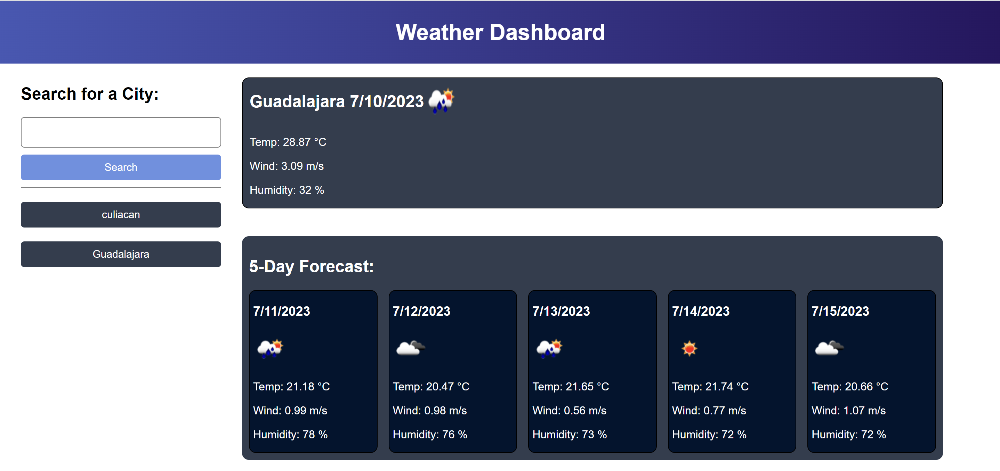

# Weather Dashboard

</img>

## Description

Third-party APIs allow developers to access their data and functionality by making requests with specific parameters to a URL. Developers are often tasked with retrieving data from another application's API and using it in the context of their own. Your challenge is to build a weather dashboard that will run in the browser and feature dynamically updated HTML and CSS.

Weather Forecast app with the help of API which would display the current weather and weather at same time for the next 5 days. uses local storage to save your previous searches and displays them again by clicking on them

## User Story

```
AS A traveler
I WANT to see the weather outlook for multiple cities
SO THAT I can plan a trip accordingly
```


## Mock-Up

The following image shows the web application's appearance and functionality:



## License

This project utilizes an MIT License. [Read more](https://choosealicense.com/licenses/mit/)

## Links

Github: <br>
https://github.com/Alexslzr/ 

Page: <br>
https://alexslzr.github.io/Weather-Dashboard/Develop/